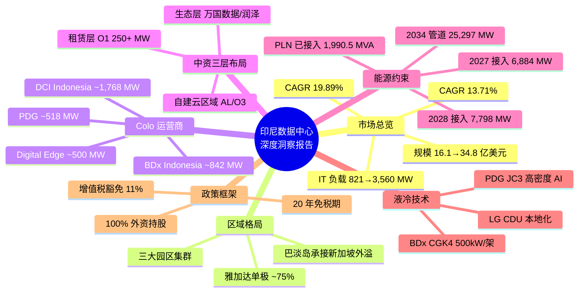

## 思维导图

## 执行摘要

> 印尼数据中心市场正经历由 **AI 大模型出海、本土数字化转型与高密液冷技术演进** 三重力量驱动的快速增长期。市场规模从 2025 年的 **16.1 亿美元** 增至 2026 年的 **18.3 亿美元**,预计 2031 年达 **34.8 亿美元**,CAGR 约 **13.71%**;以 AI 及配套算力口径计算,2026—2030 年 CAGR 可达 **28.7%**。竞争格局呈"本土龙头 + 跨国中立 IDC + 中资云厂商"三足鼎立,核心约束是电力与并网。

最近在做印尼数据中心市场深度梳理,有三个数字特别值得拎出来:**2034 年数据中心电力管道 25,297 MW vs 现有接入仅 1,990.5 MVA**;**DCI Indonesia 119 MW 运营 + 1,768 MW 总管道,占据本土龙头地位**;**BDx CGK4 单机架 500 kW 直接芯片液冷,锁定 PLN 845 MVA**。雅加达单极占全国 75% 容量,巴淡岛凭借 35 分钟船程与 20 年免税承接新加坡外溢,2027—2028 年将是电力接入的峰值考验期。这篇报告按 8 节拆解:从市场规模、区域格局、运营商矩阵、中资布局,到能源约束、液冷技术演进、政策框架与关键判断——一句话,印尼的爆发力取决于电网交付节奏,液冷与中资三层布局共同重塑竞争维度。

---

## 一、市场规模与爆发动能

| 指标 | 数值 | 备注 |
|---|---|---|
| 2025 年市场规模 | **16.1 亿美元** | Mordor Intelligence |
| 2026 年预测 | **18.3 亿美元** | Mordor Intelligence |
| 2031 年预测 | **34.8 亿美元** | Mordor Intelligence |
| CAGR(2025—2031) | **13.71%** | Mordor Intelligence |
| AI 配套口径 CAGR(2026—2030) | **28.7%** | 行业研究 |

**数据中心建设管线亮点**:

- 待建项目 **32 个** 新数据中心,预计新增超 **925 万平方英尺** 白区面积
- 约 **1.9 GW** IT 负载容量处于建设管线中
- 雅加达在建电力容量超 **1.4 GW**,占绝对主导地位
- 2030 年后规划容量合计约 **4.8 GW**,DCI 与 BDx 两家预计掌握 **46%(约 2.2 GW)**

印尼数据中心市场的增速在东南亚处于领先梯队。若以 AI 及配套算力口径计算,2026—2030 年 CAGR 可达 **28.7%**,反映出 AI 工作负载对机架密度和单位面积产值的结构性提升。

**核心驱动力**:

**AI 大模型出海** 是最直接的催化剂。O1、AL与O3等头部厂商将印尼作为东南亚核心算力据点。O1存量机房容量约 **43 MW**,规划/在建 **107 MW**,2026 年新增规划达 **100 MW**,远期规模超 **250 MW**。**本土数字化转型** 提供持续需求底座:印尼 2.72 亿人口的数字消费激增,数字经济规模预计 2026 年达 **1300 亿美元**。**政策激励** 方面,经济特区内允许 **100% 外资持股**,企业所得税免税期最长可达 **20 年**。

---

## 二、区域格局:雅加达单极与巴淡岛崛起

### 雅加达-西爪哇:绝对核心

雅加达及周边地区占全国运营容量约 **75%**。雅加达拥有 **71 个** 数据中心、**36 家** 运营商,在建电力容量 **1,847 MW**。Cikarang 一个区就承担了全国 **47%** 的运营容量。大雅加达地区以 50 家客户和 **1,047 MVA** 接入容量领先,西爪哇紧随其后,63 家客户和 **1,036.36 MVA**。

### 巴淡岛:新加坡溢出与合规枢纽

巴淡岛凭借距新加坡仅 **35 分钟** 船程的区位优势,成为"合规 + 低成本 + 低延迟"的第二落点。Nongsa 数字园区提供 **20 年免税、100% 外资持股** 的政策礼包。巴淡岛数据中心产业年增长率达 **22%**,高于全国平均增速。BW Digital 在 Nongsa 数字园的 IT 负载容量达 **120 MW**,DayOne 正在开发 **450 MW** 超大规模数据中心,Oracle 也已选择 Nongsa 数字园建设云区域。

### 区域对比

| 区域 | 核心定位 | 代表运营商 | 关键特征 |
|---|---|---|---|
| 雅加达 / 西爪哇 | 企业托管、云接入、超大规模 | DCI、BDx、PDG、STT GDC | 占全国 ~75% 运营容量,Cikarang 承担 47% |
| 巴淡岛 | 新加坡溢出、合规枢纽、AI 算力 | DayOne、BW Digital、Oracle | 距新加坡 35 分钟,20 年免税,年增 22% |
| Jatiluhur(西爪哇) | AI 超大规模园区 | BDx CGK4 | 640 MW 园区,845 MVA 电力锁定 |

---

## 三、Colo 运营商竞争格局

| 运营商 | 已运营(MW) | 在建(MW) | 规划/储备(MW) | 总管道(MW) | 核心定位 |
|---|---|---|---|---|---|
| **DCI Indonesia** | 119 | 36 | ~1,600+ | **~1,755** | 本土龙头,6 家全球云厂商入驻 |
| **BDx Indonesia** | ~89 | ~100 | 640 | **~829** | NVIDIA DGX-Ready,1.2 GVA+ 电力锁定 |
| **PDG** | 45 | ~60 | 244 | **~518** | JC3 获 8.56 亿美元绿色融资 |
| **Digital Edge** | 29 | 30.1 | 441 | **~500** | GIIC 园区 500 MW,可扩至 1 GW |
| **NeutraDC** | 90 | — | 110 | **200** | Telkom 旗下,与 PLN 合作扩容 |
| **STT GDC** | 18 | 24 | 292 | **~334** | 雅加达园区总管道 360 MW+ |

### DCI Indonesia:本土龙头

DCI 是印尼最大的本土中立数据中心运营商,运营容量 **128 MW**,长期目标超 **300 MW**。旗下 JK1—JK5 已投运,JK6(36 MW)于 2025 年 6 月投运,为印尼最大单体数据中心。远期规划包括 H2 Campus(Karawang,**600 MW+**,配 30 MW 太阳能农场)和 H5 Sky Bintan(Bintan,**1 GW+**,毗邻新加坡)。

### BDx Indonesia:AI 就绪先锋

BDx 与 Indosat Ooredoo Hutchison 及 Lintasarta 合资,核心项目为 Jatiluhur **CGK4 AI 数据中心园区**,规划总容量 **640 MW**,分 6 栋建筑建设。首栋 **120 MW** 预计 **2027 年初** 投运,采用 **direct-to-chip 液冷** 架构,支持单机架最高 **500 kW** 功率密度。园区已获 **NVIDIA DGX-Ready Colocation** 认证,并锁定 PLN **845 MVA** 电网容量,属于 BDx 在印尼 **1.2 GVA+** 电力布局的一部分。

### PDG:绿色融资标杆

PDG 在印尼部署 JC1—JC2(12 MW)及 JC3(120 MW 园区,首期 60 MW),JC3 获 **8.56 亿美元** 绿色融资。JC3 专为高密度 AI 算力设计,采用液冷技术,是雅加达首批液冷园区之一。

---

## 四、中资企业布局:三层结构与双轨模式

### 中资"三层布局"

- **租赁层**:O1作为 BDC 等运营商的锚定租户,存量 **43 MW** + 在建 **107 MW**,远期超 **250 MW**
- **自建云区域层**:AL云运营两座数据中心,2026 年新增第三座;O3云拥有 3 座数据中心(**50 MW+**),2026 年再投 **5 亿美元** 建设第三座
- **生态层**:万国数据(GDS)在巴淡岛布局,润泽科技规划巴淡岛 360 MW 项目

### 标杆案例

O3云最突出的成绩是帮助印尼最大科技集团 **GoTo 将 Gojek 的出行、配送业务整体迁上云**——这是东南亚规模最大的迁云项目,同时还在为比亚迪、阿斯利康等跨国企业提供云服务。华为云雅加达 3 个可用区 **利用率达 90.99%**,可用性 99.99%、时延 20 毫秒。

### 投资规模

O1约 **28 亿美元**,O3云 **5 亿美元**(至 2030 年),AL云节点扩容。此外,DAMAC Digital 投资 **23 亿美元** 建设 AI-ready 数据中心,润泽/秦淮在巴淡岛布局大型园区。

---

## 五、能源、水与交付约束

### 电力:核心瓶颈

| 指标 | 数值 |
|---|---|
| 现有接入容量 | **1,990.5 MVA** |
| 2027 年需接入 | **6,884 MW** |
| 2028 年需接入 | **7,798 MW** |
| 2034 年电力管道 | **25,297 MW** |

印尼电力供应面临结构性挑战。虽然全国存在约 **9 GW** 过剩发电容量(主要在爪哇和苏门答腊),但站点级接入需 **3-12 个月**。PLN 已接入 **159 家** 数据中心,总容量 **2,038 MVA**。数据中心电力管道预计 **2034 年达 25,297 MW**,需在 2027—2028 年集中完成 **6,884 MW** 和 **7,798 MW** 接入。

### 重点项目电力锁定

- **BDx CGK4**:**845 MVA**(PLN),另探索 Jatiluhur 水电站水电供应
- **DayOne 巴淡岛**:**511 MVA**(PLN Batam),印尼迄今最大数据中心购电协议
- **Digital Edge**:**2×725 MVA**(PLN)

### 水资源与可再生能源

巴淡岛 Nongsa 数字园规划的数据中心群日用水量预计达 **2,900 万升**,相当于巴淡岛现有供水的 **8.4%**。BDx CGK4 选址 Jatiluhur 大坝附近,可获得充足的清洁水源。PLN 积极发展可再生能源并推出绿色电价和可再生能源证书。Pertamina 地热能源(PGE)确认地热可作为基载可再生能源支撑数据中心和 AI 生态系统。

---

## 六、技术演进:液冷加速渗透

随着高功率密度 GPU 集群(H100、Blackwell)的导入,印尼数据中心建设正迅速从传统风冷转向风冷 + 液冷混合及全液冷架构。

| 项目 | 运营商 | 液冷方案 | 功率密度 | 状态 |
|---|---|---|---|---|
| CGK4 Jatiluhur | BDx | Direct-to-chip 液冷 | **500 kW/机架** | 2027 年初首栋投运 |
| JC3 Bekasi | PDG | 液冷设计 | 高密度 AI | 建设中 |
| CGK Campus GIIC | Digital Edge | Direct-to-chip 液冷 | AI 负载 | 2026 Q4 首期 |
| STT Jakarta 2/3 | STT GDC | 风冷+液冷混合 | >15 kW/机架 | 2026-2027 投运 |

### 液冷供应链本地化进展

LG 电子的 600 kW CDU 获 NVIDIA 认证,已获得雅加达 Sinar Mas 数据中心冷却项目。这表明液冷设备供应链正在向印尼本地延伸。STT Jakarta 3 已集成支持传统风冷和先进 **Liquid-to-Chip 冷却** 的基础设施,可容纳 NVIDIA H200/B200 等最新 GPU 集群。

---

## 七、政策框架

| 政策维度 | 具体内容 | 影响 |
|---|---|---|
| 外资持股 | 2021 年第 49 号总统令,数据中心允许 **100% 外资持股** | 降低市场进入门槛 |
| 企业所得税豁免 | 经济特区内最长 **20 年** 免税期,按投资规模分档 | 显著降低前期税负 |
| 进口设备增值税 | 经济特区内 **增值税豁免**,降低 capex 约 11% | 降低设备采购成本 |
| OSS 审批系统 | 在线单一提交,审批周期压缩至最短 **10 周** | 加速项目落地 |
| 数据主权 | 政府和金融信息须存储在境内基础设施 | 推动本地云区域建设 |
| TKDN 本地含量 | 美国企业 ICT/数据中心产品可获豁免,允许进口专用服务器与冷却系统 | 降低合规压力 |

---

## 八、关键判断

### 1. 印尼是东南亚增速最快的市场之一,但兑现能力取决于电网

电力管道 25,297 MW vs 现有接入 1,990.5 MVA,2027—2028 年需集中完成超 14 GW 接入,电网建设速度是核心变量。已锁定 PLN 大容量供电协议者(BDx、DayOne、Digital Edge)获得超额份额。

### 2. 中资"三层布局"已成型

O1(租赁+自建)、AL/O3(自建云区域)、万国数据/润泽(生态层)构成中资在印尼的立体布局。O3云 GoTo 迁云项目是东南亚最大规模迁云案例,验证了中资云服务商的本地化能力。

### 3. 液冷从可选变为必选

BDx CGK4(500 kW/机架)、PDG JC3、Digital Edge CGK Campus 全面采用 direct-to-chip 液冷。LG CDU 获 NVIDIA 认证并落地雅加达,液冷供应链正在向印尼本地延伸。

### 4. 巴淡岛是合规与溢出双重红利的受益者

距新加坡 35 分钟、20 年免税、100% 外资持股,BMI 将其定位为"监管合规枢纽"。DayOne 450 MW、Firmus 360 MW、BW Digital 120 MW 构成巴淡岛的核心管道。

### 5. 地方审批合规是项目交付的关键风险点

2026 年 10 月 5 日,西爪哇省长要求 CGK4 停止施工,原因是必要许可尚未取得、环境影响评估未完成。这表明即使在政策激励框架下,地方层面的审批合规仍是项目交付的关键风险。

---

## 数据口径与来源说明

- **IT 负载口径**:仅计算数据中心实际可用于部署服务器的算力容量,已扣除冷却、配电等基础设施损耗。
- **市场规模**:Mordor Intelligence,2025 年 16.1 亿美元 → 2026 年 18.3 亿美元 → 2031 年 34.8 亿美元(CAGR 13.71%)。
- **运营容量基线**:DC Atlas 显示全国 96 个数据中心、78 个运营、1,943 MW 在建;DCI Indonesia 运营 119 MW;BDx Indonesia 运营 89 MW。
- **电力约束**:PLN 接入 159 家数据中心,容量 2,038 MVA;2034 年电力管道 25,297 MW;BDx 锁定 845 MVA,DayOne 签署 511 MVA 购电协议。
- **政策框架**:2021 年第 49 号总统令允许数据中心 100% 外资持股;经济特区最长 20 年企业所得税免税期。
- **液冷技术**:BDx CGK4 采用 direct-to-chip 液冷,支持 500 kW/机架;STT Jakarta 3 支持 Liquid-to-Chip 冷却。

*数据截至 2026-10-05 · 口径:IT 负载 · 单位 MW · 公开信息交叉验证*

*免责声明:本报告基于公开信息整理与交叉验证,部分运营商容量数据存在口径差异与重叠,预测情景存在不确定性,仅供一般信息与研究参考,不构成任何投资、法律或商业决策建议。*
