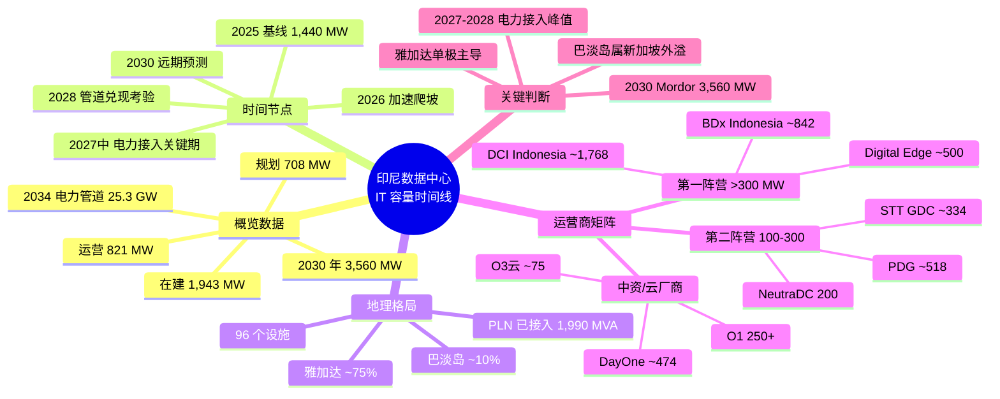

## 思维导图

## 核心观点

> 2025 年印尼全国运营 IT 容量约 **1,440 MW**（Mordor 口径，含云厂商自建与预租；DC Atlas 显示 821 MW），雅加达占 **~75%**，巴淡岛 ~10%。**2026 年底冲 1.8-2.0 GW，2030 年 Mordor 预测 3,560 MW**，IDPRO 乐观情景 11-12 GW，PLN 3.5 GW。**核心约束是电力**——数据中心电力管道 2034 年达 25,297 MW（PLN），现有接入仅 1,990.5 MVA，2027-2028 年是接入峰值期。

印尼这两年是东南亚 AIDC 第三枢纽的关键成长期——雅加达 + 巴淡岛双轨：雅加达本土需求为主（O1、TikTok、印尼电商生态），巴淡岛承接新加坡外溢（DayOne、Oracle AI 集群）。三股力量叠加：AI 算力外溢 + 中资云厂商双轨（O1 250+ MW、O3 75 MW、AL未披露）+ 美系与本土运营商扩产。但**真正的瓶颈是电力**——2034 年 25 GW 电力管道 vs 2025 年仅 1,990 MVA 接入，2027-2028 年是 PLTdianan.com 与电力接入的峰值考验。本文按五个时间节点拆解 IT 负载口径下的运营 / 在建 / 规划三档存量，附运营商管道矩阵与 2027-2028 电力约束判断。

---

## 一、概览数据

| 时点 | 指标 | 数值 | 备注 |
|---|---|---|---|
| **2025（基线）** | 运营 IT | **~1,440 MW** | Mordor 口径；雅加达 ~75%、巴淡岛 ~10%；96 个设施 |
| **2026 年底** | 运营 IT（推算） | **~1.8-2.0 GW** | 本阶段新增 ~114 MW；O1 +100 MW |
| **2027 年中** | 运营 IT（推算） | **~2.5-3.0 GW** | **电力接入关键期**：PLN 已接入 1,990.5 MVA |
| **2028 年底** | 运营 IT（推算） | **~2.4 GW** | **管道兑现考验**：政府管道剩余 ~1.3 GW；巴淡岛 841 MW |
| **2030 年** | 运营 IT（Mordor） | **3,560 MW** | PLN 预测 3.5 GW；IDPRO 乐观 11-12 GW |
| **2034 年** | 电力管道（PLN） | **25.3 GW** | 政府远期电力规划口径 |

**CAGR**：IT 负载 19.89%（2025-2030，Mordor）；市场规模 13.71%（2026-2031）。**空置率：极低**——雅加达园区普遍满租，电力接入等待 3-12 个月。

**口径说明**：DC Atlas 显示 2026 年运营 821 MW、在建 1,943 MW、规划 708 MW（总潜力 4,023 MW）；Mordor 口径 2025 年 1,440 MW（含云厂商自建与预租）。两口径差异源于是否纳入预租/规划项目。

---

## 二、2025 年 · 基线

**全国运营 IT 容量约 1,440 MW（Mordor 口径），雅加达 ~75%，巴淡岛 ~10%。**

| 项目 / 运营商 | 地点 | IT 容量 | 锚定租户 / 状态 |
|---|---|---|---|
| DCI Indonesia JK1-JK5 | Cibitung, 西爪哇 | **132 MW** | 6 家全球云厂商入驻，印尼最大本土运营商 |
| BDx Indonesia CGK1-CGK3 | 雅加达及周边 | **102 MW** | NVIDIA DGX-Ready，1.2 GVA+ 电力锁定 |
| PDG JC1 + JC2 | 芝比栋 / Cikarang | **45 MW** | JC3 获 8.56 亿美元绿色融资 |
| NeutraDC | 雅加达等 | **90 MW** | Telkom 旗下，规划扩至 200 MW |
| STT GDC 雅加达 | Cikarang | **18 MW** | 园区总管道 360 MW+ |
| Digital Edge EDGE1+EDGE2 | 雅加达市中心 | **29 MW** | EDGE1 100% 可再生能源证书供电 |
| DayOne NDP1 一期 | 巴淡岛 Nongsa | **~24 MW** | Oracle H100/Blackwell 集群 |
| O1存量机房 | 雅加达 | **~43 MW** | 自建+租赁混合，TikTok/豆包业务 |

**结构特征**：雅加达（大雅加达区含 Cibitung、Cikarang、Bekasi）占全国 75% 以上；巴淡岛 10% 是新加坡外溢；其余分布在泗水、万隆等二线城市。DCI 是本土运营商龙头（6 家全球云入驻）；BDx 由印尼最大 ICT 集团 Indosat 与新加坡数据中心运营商 ST Telemedia 合资，是 NVIDIA DGX-Ready 主力。

---

## 三、2026 年底 · 加速爬坡

**全国运营 IT 容量推算 1.8-2.0 GW，本阶段新增 ~114 MW。**

| 新增项目 / 运营商 | 地点 | 新增 IT 容量 | 关键节点 |
|---|---|---|---|
| DCI JK6 | Cibitung, 西爪哇 | **36 MW** | 2025 年 6 月投运，印尼最大单体数据中心 |
| STT Jakarta 2 | Cikarang | **24 MW** | 2026 年 6 月投运，支持液冷与 AI 负载 |
| Digital Edge CGK3 | GIIC, Bekasi | **30.1 MW** | 2026 Q4 投运，500 MW 园区首期 |
| DayOne NDP1 二期 | 巴淡岛 | **+24 MW** | 园区总容量达 72 MW |

**O1远期规划**：存量 43 MW + 在建 107 MW + 远期 100 MW+（累计 250 MW+）。

**关键判断**：本阶段增长动能来自"已开建项目交付"，并非新签约潮。DCI JK6（36 MW）单栋楼即印尼最大单体；Digital Edge CGK3 是 GIIC 园区 500 MW 首期。巴淡岛 DayOne 二期使其园区容量从 24 MW 翻至 72 MW，为后续承接 Oracle AI 训练负载铺路。

---

## 四、2027 年中 · 电力接入关键期

**全国运营 IT 容量推算 2.5-3.0 GW，本阶段新增 ~229 MW。**

> ⚠ **电力警示**：数据中心电力管道 2034 年达 **25,297 MW**，现有接入仅 **1,990.5 MVA**。**2027 年需完成 6,884 MW 接入，2028 年 7,798 MW——峰值接入年**。BDx 已锁定 1.2 GVA 电力合约，DayOne 签署印尼最大数据中心购电协议（511 MVA）。

| 新增项目 / 运营商 | 地点 | 新增 IT 容量 | 关键节点 |
|---|---|---|---|
| BDx CGK4 首栋 | Jatiluhur, 西爪哇 | **120 MW** | 2027 年初投运，845 MVA 电力锁定 |
| PDG JC3 一期 | GIIC, Bekasi | **~60 MW** | 120 MW 园区首期，8.56 亿美元绿色融资 |
| STT Jakarta 3 | Cikarang | **~24 MW** | 2026 年封顶，预计 2027 年投运 |
| O3云第三座数据中心 | 雅加达 | **~25 MW** | 投资 5 亿美元，三 AZ 架构 |

**结构性矛盾**：

1. **电力申请 vs 已接入**：2025 年 PLN 已接入 1,990.5 MVA，2034 年需达 25 GW——9 年增长 12 倍以上，年均接入约 2.6 GW。
2. **峰值年份**：2027（6,884 MW）+ 2028（7,798 MW）合计需完成 14.7 GW 接入，是 2025 年已接入量的 7 倍以上。
3. **园区级别的"先到先得"**：BDx（845 MVA）、DayOne（511 MVA）已锁定优质变电站资源——这是新进入者最难逾越的门槛。

---

## 五、2028 年底 · 管道兑现考验

**全国运营 IT 容量推算 ~2.4 GW，政府管道剩余 ~1.3 GW，巴淡岛达 841 MW。**

| 新增项目 / 运营商 | 地点 | 新增 IT 容量 | 关键节点 |
|---|---|---|---|
| BDx CGK4 二期 | Jatiluhur | **~200 MW** | 总园区 640 MW，845 MVA 电网容量 |
| Digital Edge CGK 扩建 | GIIC, Bekasi | **~200 MW** | 4.5 亿美元投资，可扩至 1 GW |
| NeutraDC 扩建 | Cikarang 等 | **~110 MW** | 与 PLN 合作，扩至 200 MW |
| DayOne 巴淡岛全量 | 巴淡岛 | **~450 MW** | 超大规模数据中心，511 MVA 购电协议 |
| O1远期规划 | 雅加达 | **累计 250 MW+** | 存量 43 MW + 在建 107 MW + 远期 100 MW+ |

**阶段特征**：

- **第二阵营发力**：PDG、STT、NeutraDC 在本阶段集中投运，从 100 MW 级迈向 300-500 MW 级
- **巴淡岛起势**：DayOne 巴淡岛全量 450 MW + Firmus AI 工厂 360 MW + BW Digital 120 MW——构成 841 MW 集群
- **园区"中产能"兑现**：BDx CGK4（640 MW 总园区）、Digital Edge CGK（500 MW 园区）开始兑现电力锁定承诺

**为什么 2028 是"考验"**：政府已宣布管道剩余 ~1.3 GW——意味着运营商已宣布但未兑现项目将面临"真兑现或退出"的清算窗口；同时 PLN 的 25 GW 远期规划能否在 2028-2034 年间落地 7-8 GW/年，决定了 2030 年 3,560 MW 预测能否兑现。

---

## 六、2030 年 · 远期预测

**全国运营 IT 容量 Mordor 预测 **3,560 MW**，PLN 预测 3.5 GW，IDPRO 乐观 11-12 GW。**

| 项目 / 运营商 | 地点 | IT 容量 | 关键节点 |
|---|---|---|---|
| DCI H5 Sky Bintan | Bintan | **1 GW+** | 毗邻新加坡，燃气+太阳能供电 |
| DCI H2 Campus | Karawang | **600 MW+** | 配 30 MW 太阳能农场 |
| PDG JC3 + JC4 | Bekasi | **累计 400 MW** | 印尼总容量达 400 MW |
| Firmus × DayOne AI 工厂 | 巴淡岛 | **360 MW** | 17 万颗 NVIDIA GPU，DSX 液冷架构 |
| DAMAC Digital | 未披露 | **144 MW** | 23 亿美元投资，AI-ready |

**预测分歧**：

- **Mordor 中位**：3,560 MW（基于已宣布管道 + 历史 CAGR 19.89%）
- **PLN 口径**：3.5 GW（电力供应能力上限）
- **IDPRO 乐观**：11-12 GW（假设 AI 资本开支持续 + 出口管制缺口持续）

**关键观察**：三种预测的差距（3.5 GW vs 11-12 GW）反映了对"AI 需求是否兑现 + 电力是否能同步接入"的不同假设。基准情景下 Mordor 的 3,560 MW 较为可信；11-12 GW 需要 PLN 在 2027-2030 年间新增 ~10 GW 接入——是当前已接入量的 5 倍以上。

---

## 七、Colo 运营商管道矩阵（精确到 MW）

按 IT 负载口径汇总；部分运营商数据存在口径差异，实际全国合计低于简单加总。

| 阵营 | 运营商 | 已运营 | 在建 | 规划/储备 | 总管道 | 锚定租户 / 特征 |
|---|---|---|---|---|---|---|
| **第一阵营 >300 MW** | **DCI Indonesia** | 132 | 36 | 1,600+ | **~1,768** | 本土龙头，6 家全球云厂商入驻 |
| | **BDx Indonesia** | 102 | ~100 | 640 | **~842** | NVIDIA DGX-Ready，1.2 GVA+ 电力锁定 |
| | **Digital Edge** | 29 | 30.1 | 441 | **~500** | GIIC 园区 500 MW，可扩至 1 GW |
| **第二阵营 100-300 MW** | **PDG** | 45 | ~60 | 244 | **~518** | JC3 获 8.56 亿美元绿色融资 |
| | **STT GDC** | 18 | 24 | 292 | **~334** | 雅加达园区总管道 360 MW+ |
| | **NeutraDC** | 90 | — | 110 | **200** | Telkom 旗下，与 PLN 合作扩至 200 MW |
| **中资/云厂商** | **O1** | 43 | 107 | 100+ | **250+** | TikTok/豆包，自建+租赁混合 |
| | **O3云** | ~50 | ~25 | — | **~75** | 三 AZ，GoTo/Gojek 整体迁云 |
| | **DayOne** | 24 | — | 450 | **~474** | 巴淡岛 NDP1，Oracle H100/Blackwell 集群 |

**总管道估算（仅上述运营商合计）**：~4,961 MW（已运营 533 + 在建 382 + 规划 4,046），叠加 PLN 政府管道剩余约 1.3 GW，全国总潜力约 6-7 GW——但**实际 2030 年运营量预计仅 3,560 MW**（管道兑现率约 50-60%）。

---

## 八、数据口径与判断

**IT 负载口径**：仅计算数据中心实际可用于部署服务器的算力容量，已扣除冷却、配电等基础设施损耗。**不等同于电网连接容量**（后者通常是 IT Load 的 1.3-1.5 倍）。

**运营容量基线**：DC Atlas 显示 2026 年全国 821 MW 运营、1,943 MW 在建、708 MW 规划，总潜力 4,023 MW；Mordor 口径 2025 年 1,440 MW（含云厂商自建与预租）。

**市场增长**：Mordor 预测 IT 负载从 2025 年 1,440 MW 增至 2030 年 3,560 MW，**CAGR 19.89%**；市场规模从 2025 年 16.1 亿美元增至 2031 年 34.8 亿美元，**CAGR 13.71%**。

**电力约束**：数据中心电力管道 2034 年达 **25,297 MW**，现有接入 1,990.5 MVA。**2027 年需完成 6,884 MW 接入，2028 年 7,798 MW**——峰值接入年。BDx 锁定 845 MVA，DayOne 签署 511 MVA 购电协议。

**巴淡岛**：年增长率 22%，BW Digital 120 MW、DayOne 450 MW、Firmus 360 MW 构成核心管道——2030 年总管道 ~841 MW（含 Firmus AI 工厂），与新加坡仅 20 公里水路。

**双轨结构**：
- **雅加达**：本土需求为主，TikTok/电商生态，6 家全球云入驻 DCI，本土运营商 + BDx + PDG + Digital Edge 集群
- **巴淡岛**：新加坡外溢承接，Oracle/AI 训练集群，DayOne + Firmus + BW Digital 集群

---

## 九、关键判断

1. **雅加达为单极主导**——占全国 75% 容量，Cibitung/Cikarang/Bekasi 三大园区集群构成"超大规模走廊"；巴淡岛 10% 但增速 22%，2030 年或升至 20%+

2. **2030 年 Mordor 预测 3,560 MW 较为可信**——基于已宣布管道与历史 CAGR 19.89%；IDPRO 乐观 11-12 GW 需要 PLN 在 2027-2030 年新增 ~10 GW 接入，概率较低

3. **2027-2028 是电力接入峰值年**——需完成 14.7 GW 接入（2025 年已接入量的 7 倍）；BDx（845 MVA）+ DayOne（511 MVA）已锁定优质变电站资源，构成最强护城河

4. **DCI + BDx 形成"双寡头"**——本土龙头 DCI（132 MW 运营 + 1,768 MW 总管道）+ 合资 BDx（102 MW 运营 + 842 MW 总管道）合计占全国已运营容量约 35% + 总管道约 35%

5. **巴淡岛是新加坡外溢"备胎"**——DayOne 450 MW + Firmus 360 MW + BW Digital 120 MW 构成 ~930 MW 集群，与新加坡 20 公里水路承接 Oracle H100/Blackwell AI 训练负载

6. **中资双轨已成型**——O1（250+ MW 远期）+ O3云（~75 MW）+ DayOne（中资背景）合计构成 ~800 MW 管道；AL云印尼两座数据中心 + 第三座 2026 年新增但容量未披露

7. **三个机构 2030 全国预测差距 3 倍**：3,560 MW（Mordor）vs 3.5 GW（PLN 电力上限）vs 11-12 GW（IDPRO 乐观）——分歧主要在 1) AI 需求是否持续兑现，2) PLN 能否在 2030 前完成 ~10 GW 电力接入，3) 政府管道剩余 ~1.3 GW 能否在 2028 前兑现

---

*数据截至 2026-10-05 | 口径 IT Load | 单位 MW*

*本文综合公开资料、DC Atlas、Mordor Intelligence、PLN、BP Batam、各运营商官方披露及行业媒体交叉验证*
