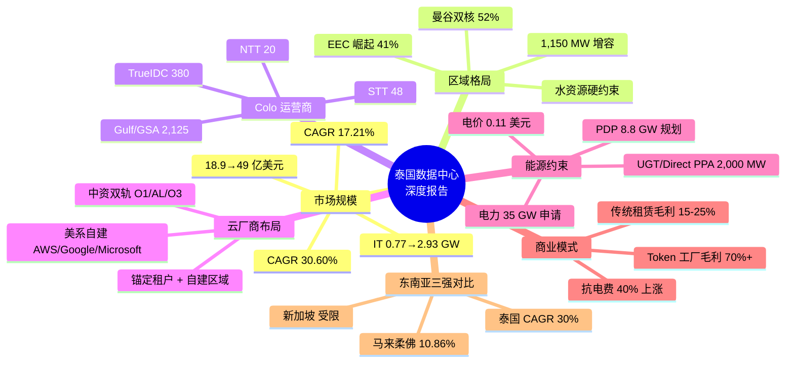

## 思维导图

## 核心观点

> 泰国是东南亚增长最快的数据中心市场——2025 年规模 **18.9 亿美元**，2031 年增至 **49 亿美元**，CAGR 约 **17.21%**；IT 负载从 **0.77 GW 增至 2.93 GW**，CAGR 高达 **30.60%**。竞争格局呈"**国际云巨头 + 中资互联网 + 本土电信运营商**"三大阵营，BOI 在 2025 年批准 **38 个**项目，IT 负载合计 **2,066 MW**。**核心风险是电力与水资源**：电力接入申请达 **35 GW**，接近全国 40 GW 峰值需求，而 PDP 仅规划 8.8 GW 数据中心配套电力。商业模式正经历从"包租公"到"Token 工厂"的深刻变革。

最近在做泰国数据中心市场的研究,有几个数字让我眼前一亮:**2030 年 IT 负载 2,930 MW,市场规模 49 亿美元**;**BOI 已批准 2,066 MW 管道**;**O1一家承诺 250 亿美元投资**;但**电力接入申请 35 GW,PDP 仅规划 8.8 GW**。一边是狂奔的 AI 算力,一边是硬性的电力约束。这篇报告把这件事拆开看:从市场规模、区域格局、运营商矩阵、云厂商锚定,到能源约束、商业模式变革——一句话:泰国是东南亚增长最快的主权 AI 战场,但 2027-2028 的电力真空期将让所有人不舒服。

---

## 一、市场规模与增长轨迹

泰国数据中心市场的增长由三重力量驱动:**AI 算力需求外溢**——超大规模云服务商加速在东南亚布局;**数据主权合规**——BOT 对金融机构的云外包规则推动数据本地化存储;**政策激励**——BOI 提供长达 13 年的企业所得税豁免。

### 市场规模(亿美元)

| 2025 年 | 2026 年预测 | 2031 年预测 | CAGR(2026-2031) |
|---|---|---|---|
| **18.9 亿** | **22.2 亿** | **49 亿** | **17.21%** |

### IT 负载容量(GW)

| 2025 年 | 2026 年预测 | 2030 年预测 | CAGR(2025-2030) |
|---|---|---|---|
| **0.77 GW** | **1.1 GW** | **2.93 GW** | **30.60%** |

**对比口径**:泰国 IT 负载增速 30.60% 远超马来西亚柔佛(~10.86%)与新加坡(受土地能耗限制),是东南亚增速最快的市场。

---

## 二、区域格局:曼谷双核与 EEC 崛起

泰国数据中心地理格局呈"**曼谷及周边 + EEC(东部经济走廊)**"双核结构。曼谷及周边容量占比约 **52%**,EEC 约占 **41%**。EEC 正加速崛起为数据中心的新增长基地,预计 2028 年在建及计划投运容量达 **149.9 MW**,接近曼谷及周边的两倍。

### EEC 区域电网规划

- 新增容量 **1,150 MW**(400 MW 已投运 + 750 MW 在建)
- 罗勇 2 号变电站:150 MW
- Phanthong 变电站:250 MW
- 春武里、罗勇两府水资源偏紧,北柳府可用水资源比例约 63%

### 双核对比

| 维度 | 曼谷及周边 | EEC(春武里/罗勇/北柳) |
|---|---|---|
| 容量占比 | ~52% | ~41% |
| 核心定位 | 企业托管、互联枢纽、云接入 | 超大规模、AI 训练、工业边缘 |
| 代表运营商 | True IDC、STT GDC、NTT、AIS | True IDC EEC、GSA、SUPERNAP |
| 电网状态 | 成熟,互联密集 | 升级中,1,150 MW 新增容量 |
| 水资源 | 充足 | 春武里/罗勇偏紧,北柳 63% |

---

## 三、Colo 运营商竞争格局

泰国 Colo 市场集中度中等,前五大运营商包括 **True IDC、STT GDC、NTT、CS LoxInfo、United Information Highway**。

| 运营商 | 已运营 IT | 在建/规划 | 总管道 | 锚定/特征 |
|---|---|---|---|---|
| True IDC(CP Group) | ~30 MW | ~350 MW | **~380 MW** | East Bangna 35 MW 园区;EEC AI 超大规模园区;缅甸仰光设施 |
| STT GDC | 22 MW | 26 MW | **48 MW** | BKK1(22 MW,2021 运营)+ BKK2(24 MW,2026 Q4)+ BKK3(2 MW) |
| GSA(Gulf+Singtel+AIS) | 25.6 MW | ~100 MW | **~125 MW** | GSA01(2025 年底)+ GSA02(2027 Q1)+ GSA05(120 MW,建设中) |
| SUPERNAP Thailand | ~15 MW | — | **~15 MW** | Tier IV 认证,春武里 |
| NTT / CS LoxInfo | ~20 MW | — | **~20 MW** | 企业托管与互联 |

---

## 四、云厂商布局

| 云厂商 | 布局 | 投资规模 | 状态 |
|---|---|---|---|
| AWS | 曼谷/春武里 3 AZ | 50 亿美元/15 年 | 2025 年 1 月上线 |
| Google Cloud | 曼谷云区域 | 10 亿美元 | 2026 年 1 月上线 |
| Microsoft Azure | 泰国 AI 数据中心 | 10 亿美元+ | 2024 年宣布,扩建中 |
| AL云 | 曼谷两座数据中心 | 未披露 | 2022 年首座 + 2025 年第二座 |
| O3云 | 曼谷双 AZ | 未披露 | 2021 年 6 月开服 |
| O1/TikTok | 曼谷、北榄、北柳 | 250 亿美元 | 分阶段建设 |

**三大阵营格局清晰**:美系自建(AWS/Google/Microsoft)+ 中资双轨(O1/AL/O3)+ 本土电信运营商(True/AIS/Singtel 合资 GSA)。

---

## 五、能源、水与交付约束

### 电力

电力接入申请达 **35 GW**,接近全国 40 GW 峰值需求,而 PDP 仅规划 **8.8 GW** 数据中心配套电力。EGAT 正升级 EEC 电网,新增 **1,150 MW** 交付能力(400 MW 已投运 + 750 MW 在建)。

**电价走势**:
- ERC 已批准 **2026 年 1-4 月电价降至 3.88 泰铢/kWh**(约 0.11 美元)
- 政府目标将电价降至 **2.50 泰铢/kWh**(约 0.07 美元)以内
- 直接 PPA 绿电成本 **3.0-4.0 泰铢/kWh**,低于常规电网 4.15-4.72 泰铢

### 水资源

春武里、罗勇两府水资源偏紧,北柳府可用水资源比例约 **63%**。水电供给已成为 EEC 选址的核心约束。液冷技术从可选项变为 AI 园区的入场券,STT Bangkok 2 已支持混合冷却环境(空气 + 液体)。

### 绿色电力政策

**UGT 与 Direct PPA 机制**:
- **UGT1**:非源特定绿电,2025 年 7 月起已投入使用
- **UGT2**:源特定绿电,降低绿色溢价
- **Direct PPA 试点**:总规模 2,000 MW,允许私营公司直接买卖绿电
- 极大满足出海企业的 ESG 考核要求

---

## 六、商业模式变革:从"包租公"到"Token 工厂"

泰国 IDC 市场正经历深刻的商业模式变革。**电费上涨挤压传统模式**:中东局势冲击国际油价,泰国工业用电成本面临上升压力(电费占传统 IDC 运营成本约 40%)。传统算力租赁毛利率仅 **15%-25%**,易陷价格战。

### "Token 工厂"抗风险机制

- 将"电力 + GPU 算力"转化为 API 输出的 Token 接口
- 生成每百万 Token 综合成本约 **$0.32**,API 售价 **$1.50-$3.00**
- 毛利率可高达 **70%+**
- 即使电费上涨 40%,毛利率依然可稳定在 **62%-65%+**

---

## 七、东南亚三强对比

| 对标维度 | 泰国 | 新加坡 | 马来西亚柔佛 |
|---|---|---|---|
| 增长潜能 | **最快(CAGR ~30%)** | 较低(受土地/能耗限制) | 稳健(~10.86%) |
| 工业电价 | **$0.11-0.13/kWh** | $0.25-0.28/kWh | $0.08-0.11/kWh |
| 土地成本 | 中等 | 极高 | 低 |
| 核心优势 | **本土巨头生态(正大)+ 主权 AI 独立性 + 绿电政策** | 成熟网络生态与金融中心 | 靠近新加坡 + 成本低廉 |

**主权与生态优势**:相比依赖新加坡溢出效应的马来西亚柔佛,泰国作为独立的大型经济体,具有更高的数据主权与地缘平衡能力。以 True IDC(正大集团 CP Group 旗下)为例,正大集团在电信(True Corporation)、零售与农业领域的深厚积淀,在拿地、电力审批及本地化场景落地方面具备强劲竞争力。

---

## 八、关键判断

### 1. 泰国是东南亚增速最快的市场,但兑现能力是核心变量

BOI 批准管道 IT 负载达 2,066 MW,而实际运营容量与之存在显著差距。项目能否按期接电、获得客户合同并爬坡至计费容量,将决定市场的真实增长轨迹。

### 2. EEC 是未来五年的主战场,但水资源是硬约束

EEC 在建 + 计划容量达 149.9 MW,接近曼谷的两倍。但春武里、罗勇两府水资源偏紧,液冷与再生水方案将成为项目获批的前置条件。

### 3. 中国企业的双轨模式正在成型

O1(250 亿美元自建)+ AL云(两座数据中心)+ O3云(双 AZ)+ 万国数据(10 亿美元)构成中资在泰国的多层次布局。泰国的监管环境相对宽松,未实施本土硬件管制或数据本地化强制要求,为中资运营商提供了独特的合规窗口。

### 4. 电力是 2027-2028 年最大的单点风险

35 GW 电力接入申请 vs 8.8 GW PDP 规划 vs 1,150 MW EEC 近期增容,三者之间的巨大缺口意味着并网排队将成为项目投运的关键路径。尽调中应将"已签约供电协议 + 明确 energization 日期"列为与土地证同级的先决条件。

---

## 数据口径与来源说明

- **IT 负载口径**:仅计算数据中心实际可用于部署服务器的算力容量,已扣除冷却、配电等基础设施损耗。
- **市场规模**:Mordor Intelligence,2025 年 18.9 亿美元 → 2031 年 49 亿美元(CAGR 17.21%)。
- **BOI 审批**:2025 年批准 38 个项目,IT 负载合计 2,066 MW,总投资 4,580 亿泰铢(约 145 亿美元)。
- **电价**:ERC 批准 2026 年 1-4 月电价 3.88 泰铢/kWh。
- **绿色电力**:UGT1/UGT2 已推出,Direct PPA 试点 2,000 MW。
- **运营商数据**:STT GDC 曼谷园区 46 MW(BKK1:22 MW + BKK2:24 MW + BKK3:2 MW);True IDC East Bangna 35 MW 公用事业容量/30 MW IT 负载。
- **免责声明**:本报告基于公开信息整理,部分容量数据存在口径差异与重叠,预测情景存在不确定性,仅供一般信息与研究参考。

---

*数据截至 2026-10-05 | 口径 IT Load | 单位 MW*

*本文综合公开资料、Mordor Intelligence、BOI、EGAT、STT GDC、True IDC 官方披露及行业研究交叉验证*
