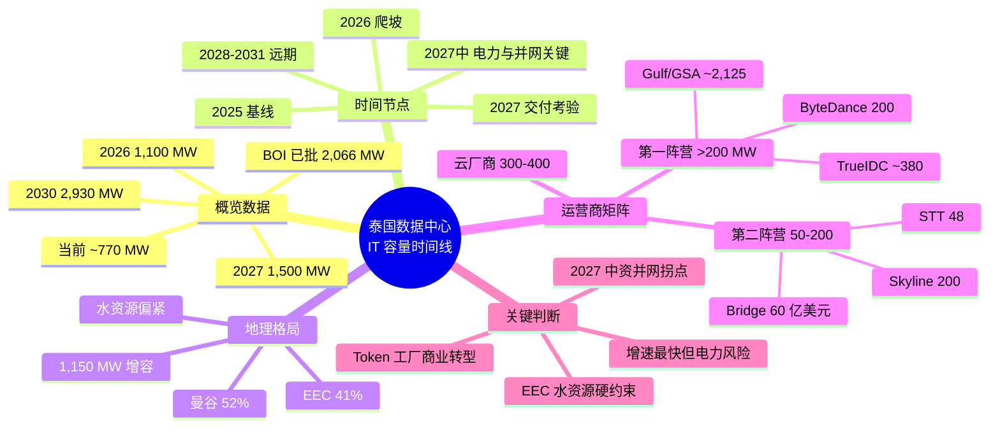

## 思维导图

## 核心观点

> 2025 年底泰国全国运营 IT 容量 **~770 MW**，曼谷 + 周边占 ~52%，EEC 占 ~41%。**2026 年底冲 1,100 MW，2027 年底到 1,500 MW**（TDCA 预测），2030 年到 **2,930 MW**（Mordor）。BOI 在 2025 年批准 38 个项目、IT 负载合计 **2,066 MW**，总投资 4,580 亿泰铢。**核心约束是电力**——电力接入申请达 35 GW，接近全国 40 GW 峰值需求，PDP 仅规划 8.8 GW 数据中心配套电力。

泰国这两年从东南亚"第三梯队"一路滚到"增长最快市场"——2025 年 770 MW、2026 年底 1,100 MW、2030 年 2,930 MW，IT 负载 CAGR 高达 30.6%。三股力量叠加：AI 算力外溢 + 中国互联网出海（O1 250 亿美元、AL双 AZ、O3双 AZ）+ 美系云自建（AWS 50 亿、Google 10 亿、Microsoft 10 亿）。但**真正的瓶颈是电力**——35 GW 申请 vs 8.8 GW 规划，PDP（电力发展计划）口径下数据中心电力供应硬性受限。本文按五个时间节点拆解 IT 负载口径下的运营 / 在建 / 规划三档存量，并标注 2027 年电力与并网关键期的风险。

---

## 一、概览数据

| 时点 | 运营 IT | 备注 |
|---|---|---|
| **2025 年底（基线）** | ~770 MW | Mordor：曼谷 ~52%、EEC ~41% |
| **2026 年底** | ~1,100 MW | Mordor 预测；BOI 38 个项目 2,066 MW 管道 |
| **2027 年中** | ~1,300-1,500 MW | **电力与并网关键期**：35 GW 申请 vs 8.8 GW 规划 |
| **2027 年底** | ~1,500 MW | TDCA 预测；EEC 1,150 MW 增容（400 + 750） |
| **2030 年** | **2,930 MW** | Mordor 预测；市场规模 49 亿美元 |

**CAGR**：IT 负载 30.6%（2025-2030），市场规模 17.21%（2026-2031）。

---

## 二、2025 年底 · 基线

**全国运营 IT ~770 MW，曼谷 ~52%、EEC ~41%。**

| 项目 / 运营商 | 地点 | IT 容量 | 锚定租户 / 状态 |
|---|---|---|---|
| True IDC East Bangna 园区 | 北榄府 Bang Sao Thong | ~30 MW | 总公用事业容量 35 MW，Tier III，多期模块化 |
| STT Bangkok 1 | 曼谷 Hua Mak | 22 MW | 2021 年 9 月运营，NVIDIA DGX Ready |
| GSA Data Center 01 | 北榄府 | 25.6 MW | Gulf + Singtel + AIS 合资，2025 年底投运 |
| SUPERNAP Thailand | 春武里 | ~15 MW | Tier IV 认证，早期进入者 |
| AWS 泰国云区域 | 曼谷/春武里 | 追踪 200 MW | 2025 年 1 月上线，承诺 50 亿美元/15 年 |
| Google 泰国云区域 | 曼谷 | 未披露 | 2026 年 1 月上线，10 亿美元投资 |
| O3云 曼谷 | 曼谷/北榄 | 双 AZ | 2021 年 6 月开服，双可用区部署 |

**BOI 已批准 2,066 MW 管道**（2025 年 38 个项目，总投资 4,580 亿泰铢约 145 亿美元）。

---

## 三、2026 年底 · 爬坡期

**全国冲 1,100 MW，本阶段新增 ~330 MW。**

| 新增项目 / 运营商 | 地点 | 新增 IT 容量 | 关键节点 |
|---|---|---|---|
| STT Bangkok 2 | 曼谷 Hua Mak | 24 MW | 2026 Q4 投入运营，支持液冷与 AI 负载 |
| True IDC EEC 超大规模项目 首期 | 罗勇府 EEC | 100+ MW | 2026 Q3 投运，总投资超 770 亿泰铢 |
| GSA Data Center 02 | 北榄府 | 38 MW | 预计 2027 Q1 COD |
| True IDC 春武里+北榄府 3 项目 | 春武里、北榄府 | 223 MW | BOI 批准，总投资 453 亿泰铢，建设中 |

**本阶段新增合计 ~330 MW。**

---

## 四、2027 年中 · 电力与并网关键期

**运营 IT 推算 1,300-1,500 MW。EGAT 正升级 EEC 电网，新增 1,150 MW 交付能力（400 MW 已投运 + 750 MW 在建）。**

| 新增项目 / 运营商 | 地点 | 新增 IT 容量 | 关键节点 |
|---|---|---|---|
| GSA Data Center 02 | 北榄府 | 38 MW | 2027 Q1 COD |
| True IDC 第 7 数据中心 | 曼谷北部 | ~30 MW | 2026 年 6 月动工，2027 Q3 投运 |
| STT Bangkok 3 | 曼谷 Pathumwan | 2 MW | 互联枢纽定位，已运营 |
| TikTok 泰国 AI 数据枢纽 首期 | 曼谷、北榄府、北柳府 | 追踪 200 MW | 总投资 8,420 亿泰铢（约 250 亿美元） |

**本阶段新增合计 ~70 MW+。**

> ⚠ **电力警示**：电力接入申请达 **35 GW**，接近全国 40 GW 峰值需求，PDP 仅规划 8.8 GW 数据中心配套电力。EGAT 正升级 EEC 电网，新增 1,150 MW 交付能力（400 MW 已投运 + 750 MW 在建）。春武里、罗勇两府水资源偏紧，北柳府可用水资源比例约 63%。

---

## 五、2027 年底 · 交付考验期

**全国运营 1,500 MW（TDCA 预测）。**

| 新增项目 / 运营商 | 地点 | 新增 IT 容量 | 关键节点 |
|---|---|---|---|
| Skyline Data Center | 北柳府 | 200 MW | 投资 460 亿泰铢，BOI 批准 |
| Gorilla Technology AI 园区 | 未披露 | 200 MW | 2026 年 7 月动工 |
| Datasection GPU 基础设施 | 曼谷、Pathum Thani | 未披露 | 投资 2.35 亿美元，高性能 GPU 服务器 |
| Bridge Data Centres 泰国园区 | 未披露 | 未披露 | 寻求 60 亿美元融资，已锁定水资源与替代能源 |

**本阶段新增合计 ~400 MW+（部分项目延至 2028）。**

---

## 六、2028 → 2031 · 远期预测

**2030 全国 IT 容量 2,930 MW；2031 年市场规模 49 亿美元；CAGR IT 负载 30.6%，市场规模 17.21%。**

| 项目 / 运营商 | 地点 | IT 容量 | 关键节点 |
|---|---|---|---|
| Gulf Development 远期规划 | 罗勇、北榄等 | 2,000 MW | 1,400 亿泰铢（43 亿美元）5 年计划，含 AI 基础设施 |
| True IDC EEC 项目后续期 | 罗勇府 EEC | 累计 200+ MW | AI 超大规模园区，分阶段建设 |
| Google Chonburi 数据中心 | 春武里 | 100 MW | 追踪容量，与 Gulf 合作的主权云项目（50 MW） |
| Microsoft 泰国 AI 数据中心 | 春武里 EEC | 100 MW | 追踪容量，超 10 亿美元投资 |
| ByteDance/TikTok 全量建设 | 曼谷、北榄、北柳 | 累计 200 MW | 总投资约 250 亿美元，分阶段交付 |
| Bridge Data Centres 扩张 | 未披露 | 未披露 | 60 亿美元贷款融资，已锁定水资源与替代能源 |

**2031 年市场规模 49 亿美元。**

---

## 七、运营商管道矩阵（精确到 MW）

按 IT 负载口径汇总；部分运营商数据存在重叠，实际全国合计低于简单加总。

| 阵营 | 运营商 | 已运营 | 在建 | 规划/储备 | 总管道 | 锚定租户 / 特征 |
|---|---|---|---|---|---|---|
| **第一阵营 >200 MW** | True IDC（CP Group） | ~30 | ~250 | ~100 | **~380** | 泰国最大运营商，East Bangna 35 MW 园区 |
|  | Gulf Development / GSA | 25.6 | ~100 | 2,000 | **~2,125** | Gulf + Singtel + AIS 合资，泰国最大电力生产商背书 |
|  | ByteDance / TikTok | — | ~200 | — | **200** | 250 亿美元投资，曼谷 + 北榄 + 北柳 |
| **第二阵营 50-200 MW** | STT GDC | 22 | 24 | 2 | **~48** | 曼谷园区总设计 46 MW |
|  | Bridge Data Centres | — | 未披露 | 未披露 | **60 亿美元融资中** | 贝恩资本旗下，已锁定水资源与替代能源 |
|  | Skyline Data Center | — | 200 | — | **200** | 北柳府，投资 460 亿泰铢 |
| **云厂商自建** | AWS / Google / Microsoft | 200+ | 100-200 | 未披露 | **300-400** | AWS 50 亿美元/15 年；Google 10 亿；Microsoft 10 亿 |

---

## 八、数据口径与判断

**IT 负载口径**：仅计算数据中心实际可用于部署服务器的算力容量，已扣除冷却、配电等基础设施损耗。电网侧需求约为 IT 负载的 1.3-1.5 倍。

**市场规模**：Mordor Intelligence 口径，2025 年 18.9 亿美元 → 2031 年 49 亿美元（CAGR 17.21%）；IT 负载 2025 年 0.77 GW → 2030 年 2.93 GW（CAGR 30.6%）。

**BOI 审批**：2025 年批准 38 个项目，IT 负载合计 2,066 MW，总投资 4,580 亿泰铢（约 145 亿美元）。2026 年 1 月再批准 7 个项目，总投资约 960 亿泰铢。

**电价**：ERC 已批准 2026 年 1-4 月电价降至 3.88 泰铢/kWh（约 0.11 美元）。

**电力约束**：EGAT 正升级 EEC 电网，新增 1,150 MW 交付能力（400 MW 已投运 + 750 MW 在建）。电力接入申请达 35 GW，PDP 仅规划 8.8 GW 数据中心配套电力。

**绿色电力政策**：UGT1（非源特定绿电）和 UGT2（源特定绿电）已推出，Direct PPA 试点规模 2,000 MW，允许私营公司直接买卖绿电。

---

## 九、关键判断

1. **泰国是东南亚 IT 负载增速最快的市场**——2025-2030 CAGR 30.6%，远高于新加坡（土地能耗受限）与马来西亚柔佛（~10.86%），三大力量叠加（AI 外溢 + 中资出海 + 美系云自建）
2. **2026-2027 是产能爬坡期**，2028 起进入 GW 级兑现期，Gulf 2,000 MW + O1 200 MW + Bridge 60 亿美元 + TrueIDC 380 MW 多轨推进
3. **2027 年中电力与并网是关键风险点**——35 GW 申请 vs 8.8 GW PDP 规划，EEC 1,150 MW 增容仅够第一批大客户入场券，后续项目排队风险陡增
4. **EEC 是未来五年的主战场，但水资源是硬约束**——春武里、罗勇两府水资源偏紧，北柳府可用水资源比例约 63%，液冷与再生水方案将成为项目获批的前置条件
5. **本土巨头生态（True IDC / CP Group）是独特护城河**——正大集团在电信（True Corporation）、零售、农业的积淀，在拿地、电力审批、本地化场景落地方面具备强劲竞争力，这是新加坡/马来西亚无法复制的优势
6. **泰国是独立大型经济体，主权 AI 与地缘平衡优势明显**——相比依赖新加坡溢出效应的马来西亚柔佛，泰国监管环境相对宽松，未实施本土硬件管制或数据本地化强制要求，为中资运营商提供独特合规窗口
7. **"Token 工厂"商业转型正在发生**——传统算力租赁毛利率仅 15-25%，电费上涨挤压严重；将"电力 + GPU 算力"转化为 API 输出的 Token 接口，毛利率可高达 70%+，即使电费上涨 40% 仍可稳定在 62-65%+

---

*数据截至 2026-10-05 | 口径 IT Load | 单位 MW*

*本文综合公开资料、Mordor Intelligence、BOI、EGAT、STT GDC、True IDC 官方披露及行业研究交叉验证*
